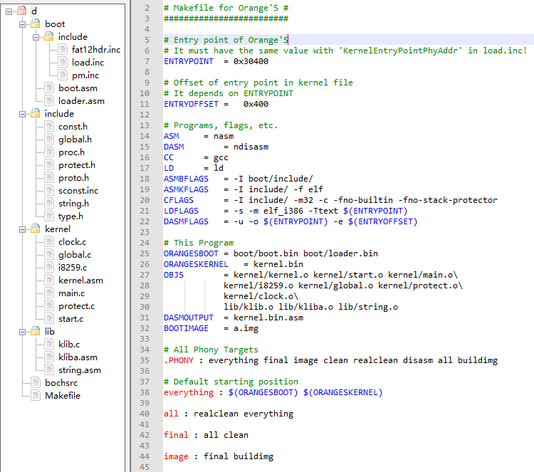
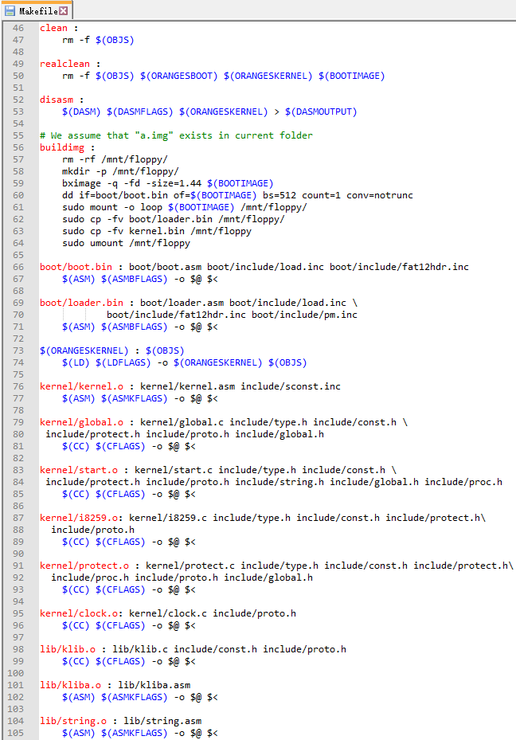

# ZMake
A Make-like build tool with GUI manipulation.  
Driven by the node-style editor project https://github.com/zcutech/NodeTiler

This project is under heavy developing now and need more time to determine framework.
 
It maybe grows up to be a universal, code-free and cross-platform build tool. 

Following images are some preview of the Basic Make functionalities.

... WIP Demo ... :

ZMake Document preview:

Source Make Project:

